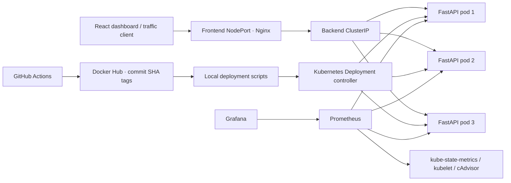
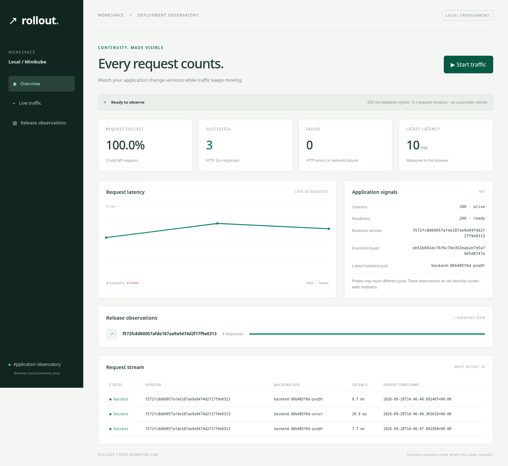

# Rollout · Kubernetes deployment observatory

A working DevOps lab for measuring application availability while Kubernetes replaces a release. React shows real browser observations; FastAPI identifies the serving pod and release; automated tests exercise a successful upgrade and an intentionally unhealthy revision followed by rollback.

Zero downtime is a **measured outcome for a specific test**, not a guarantee made by a Deployment manifest. This project preserves raw traffic evidence in `artifacts/` and never substitutes simulated numbers for live metrics.



## Stack and repository

React 19, TypeScript, Vite, Tailwind CSS 4; Python 3.12, FastAPI, Uvicorn and Prometheus client; Docker, Nginx and Minikube; GitHub Actions and Docker Hub; optional kube-prometheus-stack (Prometheus, Grafana and Kubernetes exporters).

| Directory | Purpose |
| --- | --- |
| `frontend/` | Responsive dashboard, component tests, Nginx proxy and multistage image |
| `backend/` | API, structured request logs, probes, metrics, unit tests and multistage image |
| `kubernetes/` | Namespace, ConfigMap, Services and Deployments, Kustomize entry point |
| `scripts/` | Build, deploy, upgrade, traffic evidence, verification and rollback |
| `tests/` | Traffic-generator integration test |
| `monitoring/` | Helm values, ServiceMonitor and importable Grafana dashboard |
| `.github/workflows/` | Test, validate, container smoke test and publish pipeline |

## Linux prerequisites and setup

Use a Linux host with Docker, Git, curl, Python 3.12+ with venv, Node.js 22.12+ and npm. Allocate at least 2 CPUs and 3 GiB to the base Minikube cluster; use 4 CPUs and 6 GiB if adding monitoring. More free host memory is needed for builds. The application is stateless and requires no database or credentials.

On Debian/Ubuntu, install the base tools:

```bash
sudo apt-get update
sudo apt-get install -y git curl ca-certificates python3 python3-venv make openssl
```

Install Docker Engine using the distribution-specific [official Docker instructions](https://docs.docker.com/engine/install/). Install a supported Node release using the [Node.js downloads](https://nodejs.org/en/download). For Linux amd64, the following installs pinned example Kubernetes tooling; select matching architecture downloads on ARM:

```bash
curl -fLO https://dl.k8s.io/release/v1.34.1/bin/linux/amd64/kubectl
curl -fLO https://dl.k8s.io/release/v1.34.1/bin/linux/amd64/kubectl.sha256
echo "$(cat kubectl.sha256)  kubectl" | sha256sum --check
sudo install -m 0755 kubectl /usr/local/bin/kubectl
curl -fLo minikube https://storage.googleapis.com/minikube/releases/v1.38.1/minikube-linux-amd64
curl -fLo minikube.sha256 https://storage.googleapis.com/minikube/releases/v1.38.1/minikube-linux-amd64.sha256
echo "$(cat minikube.sha256)  minikube" | sha256sum --check
sudo install -m 0755 minikube /usr/local/bin/minikube
```

Verify `docker info`, `node --version`, `python3 --version`, `kubectl version --client`, and `minikube version`. Docker daemon access is required; Docker group membership grants root-equivalent host privileges. See [Minikube setup](https://minikube.sigs.k8s.io/docs/start/) for driver details.

```bash
make setup
make test
make dev
# Dashboard: http://localhost:8080
# API: http://localhost:8000/api/version
```

Compose builds the production images locally. For hot reload, run `.venv/bin/uvicorn app:app --app-dir backend --reload` in one terminal and `cd frontend && npm run dev` in another. Vite proxies `/api` and `/health` to port 8000. Stop Compose first if it owns that port.

## API and dashboard behavior

| Endpoint | Behavior |
| --- | --- |
| `GET /api/version` | Version, hostname, UTC timestamp and readiness; HTTP 503 when unready |
| `GET /health/live` | HTTP 200 while the process can serve requests |
| `GET /health/ready` | HTTP 200 when ready, otherwise HTTP 503 |
| `GET /metrics` | Prometheus counters and latency histogram, plus Python process metrics |

`APP_VERSION` is baked into each image from its Git SHA. `STARTUP_DELAY_SECONDS` delays readiness without blocking liveness. `FAIL_READINESS=true` creates a permanently unready revision. These settings are read at process startup. ConfigMap changes need a pod restart to take effect.

The dashboard begins empty. Start traffic to issue sequential requests with a 500 ms pause after each cycle and a 5 second timeout. API counters exclude the separate health probes. It keeps the latest 60 latency samples, latest 10 request rows, and session-wide counters/version counts. Stop cancels in-flight work. Reloading resets the session. A stopped dashboard retains its last observations; they are not a fresh health assessment.

Frontend version is build metadata. Backend versions, server timestamps and pod names come from actual response bodies. Latency is browser elapsed time. Health calls may hit different pods. **The dashboard does not query Kubernetes or claim a count of ready replicas.** Use kubectl and Grafana for cluster state. Nginx disables upstream retries so the traffic test can expose failed requests.

## Deploy release 1 to Minikube

Scripts operate on the active kubectl context and the dedicated `rolling-demo` namespace. Confirm the context before any deployment or cleanup. Local images load into profile `rolling-demo` by default; override `MINIKUBE_PROFILE` if necessary.

```bash
minikube start -p rolling-demo --driver=docker --cpus=2 --memory=3072
kubectl config use-context rolling-demo
# If this scaffold is not yet a Git repository, initialize and commit it first.
git init
git add .
git commit -m "Add rolling deployment lab"
export TAG=$(git rev-parse HEAD)
export REGISTRY=local
LOAD=true make build
make deploy
kubectl -n rolling-demo get pods -o wide
kubectl -n rolling-demo rollout status deployment/backend
python3 scripts/verify_rollout.py --image "$REGISTRY/rolling-backend:$TAG" --version "$TAG"
```

Deployment rendering replaces image placeholders before applying. Never deploy the `:local` placeholders directly. Tags must be full 40-character commit SHAs. Do not overwrite a published SHA tag; registry-side tag immutability or deployment by digest is recommended for stronger enforcement. Base images use explicit version families; pin their digests in a hardened delivery pipeline.

Expose the frontend in another terminal:

```bash
minikube -p rolling-demo service frontend -n rolling-demo --url
# Or use a stable local URL for all scripts:
kubectl -n rolling-demo port-forward service/frontend 8080:8080
```

Use `http://localhost:8080` with port-forwarding. For the NodePort URL, export `BASE_URL` for smoke and rollout tests and pass `--url "$BASE_URL/api/version"` to the traffic generator. Port-forwarding to a frontend pod is appropriate for backend rollout tests; use NodePort when testing frontend replacement too.

## Successful rolling-update walkthrough

1. Complete the release 1 deployment and verify three ready replicas.
2. Open the dashboard and start traffic. In another terminal, watch pods and rollout history:

   ```bash
   kubectl -n rolling-demo get pods -w
   kubectl -n rolling-demo rollout history deployment/backend
   ```

3. Make an application change, commit it, then build a distinct release 2:

   ```bash
   git add . && git commit -m "Release version 2"
   export TAG=$(git rev-parse HEAD)
   LOAD=true make build
   # Optional Docker Hub publication (authenticate with docker login first):
   # REGISTRY=your-dockerhub-user PUSH=true make build
   ```

4. Run the automated test, which starts traffic before changing the image:

   ```bash
   make rollout-test
   kubectl -n rolling-demo rollout status deployment/backend
   kubectl -n rolling-demo rollout history deployment/backend
   cat artifacts/rollout.json
   ```

The script checks three updated/ready/available replicas, probes **every backend pod** directly to verify the version, and requires both the previous and new version to be observed through the frontend. Expected success: positive request count, zero failures, both versions seen, and all three final pods serving the new SHA. A failed check exits nonzero and preserves evidence. `make upgrade` performs just the image update and replica verification.

Standalone traffic test:

```bash
python3 scripts/traffic.py --duration 180 --interval 0.1 \
  --url http://localhost:8080/api/version \
  --output artifacts/manual.json --assert-zero-failures
```

Reports include totals, successes, failures, min/mean/p95/max latency, observed versions and individual samples. There are no retries. This is a sequential availability sampler, not a high-concurrency load benchmark; latency includes connection and body-read time, including failed requests.

## Why the rolling strategy works

The backend has three replicas, `maxSurge: 1`, `maxUnavailable: 0` and a five-second minimum ready interval. Kubernetes can create a replacement before removing an available old pod. Readiness gates Service traffic; liveness detects a process that can no longer respond; the startup probe gives the server time to bind before liveness begins. Startup initialization is represented by delayed readiness.

Capacity must cover the surge pod **and potentially terminating pods**, plus the frontend and system workloads. Resource starvation can stall progress. A five-second preStop delay allows endpoint removal to propagate before Uvicorn receives SIGTERM; Uvicorn then permits up to 20 seconds for in-flight work within a 35-second pod termination grace period. This finite delay reduces risk but is not an absolute networking guarantee. Nginx uses its image's graceful shutdown behavior. Old and new APIs must remain mutually compatible; schema migrations should use expand/contract techniques. A single-node Minikube lab provides no node-failure high availability.

See the upstream [Deployment strategy documentation](https://kubernetes.io/docs/concepts/workloads/controllers/deployment/) and [Pod termination lifecycle](https://kubernetes.io/docs/concepts/workloads/pods/pod-lifecycle/#pod-termination).

## Failed release and rollback

```bash
make failure-test
```

This changes the backend pod template to `FAIL_READINESS=true`, creating a new revision of the same image. It waits for Kubernetes to report `ProgressDeadlineExceeded`, verifies that three old replicas remain available, confirms the new pod returns 503 on readiness, and inspects EndpointSlices to ensure the unhealthy pod is absent from **ready** targets. Traffic continues throughout. A `finally` block rolls back even if an assertion fails. Failure snapshots and traffic results go to `artifacts/`.

Manual equivalent:

```bash
kubectl -n rolling-demo set env deployment/backend FAIL_READINESS=true
kubectl -n rolling-demo get pods -w
kubectl -n rolling-demo rollout status deployment/backend --timeout=150s
# Expected: timeout/deadline failure; old ready pods remain available.
kubectl -n rolling-demo get endpointslices -l kubernetes.io/service-name=backend -o yaml
kubectl -n rolling-demo rollout undo deployment/backend
kubectl -n rolling-demo rollout status deployment/backend
python3 scripts/verify_rollout.py
```

Kubernetes reports stalled progress but does **not** automatically roll back. `make rollback` undoes the latest revision and checks the resulting replicas. Use `--to-revision=N` manually if the previous revision is not the desired working release. Run demo scripts serially; concurrent changes invalidate revision assumptions.

## Tests and CI/CD

```bash
make test             # Python lint/API/traffic tests; frontend lint/tests/build; local manifest policies
make container-test   # Build and start an isolated Compose project, smoke-test, then remove it
make smoke            # Test an already-running frontend and its backend proxy
make rollout-test     # Requires cluster and a distinct built/available TAG
make failure-test     # Requires a healthy deployed cluster; exercises rollback
```

`make validate` checks deployment policies and renders Kustomize. CI additionally runs strict Kubernetes schema validation using kubeconform. Container tests use dynamically assigned localhost ports and need a Docker daemon. All scripts fail nonzero when required checks fail; inspect the command output and JSON artifacts. See [VALIDATION.md](VALIDATION.md) for checks actually executed in the implementation environment.

On pull requests and pushes to `main`, GitHub Actions runs frontend and backend checks, manifest validation and container smoke tests. After a successful `main` push, it publishes both images as `DOCKERHUB_USERNAME/rolling-{backend,frontend}:GITHUB_SHA`. Set repository secrets `DOCKERHUB_USERNAME` and `DOCKERHUB_TOKEN` (a scoped Docker Hub access token). Protect `main` to require passing checks. PR jobs never log into the registry. No credentials belong in the repository.

GitHub-hosted runners do not deploy into your local Minikube. After publication, run locally:

```bash
export REGISTRY=your-dockerhub-user TAG=<published-full-commit-sha>
make deploy  # both applications, or make upgrade for backend only
```

For private images, create a namespace-scoped imagePullSecret and reference it in the pod specs. The default examples assume public Docker Hub images or images already loaded into Minikube.

## Advanced monitoring

Install Helm 3 using its [official installation guide](https://helm.sh/docs/intro/install/). Allocate additional cluster resources before installing kube-prometheus-stack. Choose an explicit compatible chart version from `helm search repo prometheus-community/kube-prometheus-stack --versions` after adding/updating the repository:

```bash
helm repo add prometheus-community https://prometheus-community.github.io/helm-charts
helm repo update
helm search repo prometheus-community/kube-prometheus-stack --versions
export MONITORING_CHART_VERSION=91.7.0  # chart used for this project validation
make monitor
kubectl -n monitoring port-forward svc/monitoring-grafana 3000:80
```

A random Grafana password is generated in a Kubernetes Secret. Retrieve it locally when logging in (username `admin`):

```bash
kubectl -n monitoring get secret grafana-admin -o jsonpath='{.data.admin-password}' | base64 -d
```

Open `http://localhost:3000`, then the **Rollout / Deployment continuity** dashboard. The dashboard ConfigMap is loaded by Grafana's sidecar; `monitoring/dashboard.json` can also be imported manually. The default kube-prometheus-stack Prometheus data source UID is `prometheus`; adjust it if your installation differs.

To verify live data after the stack becomes ready, keep a Prometheus port-forward running, send some API traffic, and allow at least two scrape intervals:

```bash
kubectl -n monitoring port-forward svc/monitoring-kube-prometheus-prometheus 9090:9090
# In another terminal, with three healthy backend replicas:
make monitor-test
```

This asserts three scraped backend targets, three ready backend pods, and real request/CPU/memory samples. It saves `artifacts/monitoring.json`.

Panels cover API request rate, API server-side 5xx ratio, p95 latency, container restarts, backend ready-pod count, CPU cores and memory working set. App metrics use the ServiceMonitor; cluster metrics come from kube-state-metrics and kubelet/cAdvisor, included in the Helm stack. Minikube may not expose every control-plane target, but app, pod and container panels should populate. Allow several scrape intervals before evaluating rate panels. CPU and memory queries prefer summed container metrics and fall back to pod-level cAdvisor aggregates when the runtime exposes only pod cgroups, as on this Docker-based Minikube host. The `or` fallback prevents counting both representations.

During a rollout, look for readiness below three, rising 5xx, latency spikes, restarts, or sustained CPU/memory growth. Browser/network failures cannot appear in backend metrics if the request never reached the app; correlate Grafana with the traffic JSON. No data means missing observations, not zero failures. Monitoring is an optional resource-intensive phase, not a prerequisite for the base deployment.

## Troubleshooting

| Symptom | Check |
| --- | --- |
| ImagePullBackOff | Image tag/registry exists, credentials if private, `minikube -p rolling-demo image ls` |
| Pending surge pod | `kubectl -n rolling-demo describe pod NAME`; CPU/memory available for old, new and terminating pods |
| Rollout never completes | Readiness response, `FAIL_READINESS`, startup delay, pod events and logs; deadline is 120 s |
| Frontend returns 502 | Backend Service endpoints, backend health, namespace and Nginx logs |
| Dashboard is empty | Start traffic; verify browser can reach same-origin `/api/version` |
| Host can't reach NodePort | Use the Minikube service URL or persistent port-forward |
| Rollout test sees only one version | Use a new commit SHA and ensure traffic is reaching this cluster |
| Grafana has no data | ServiceMonitor CRD exists, backend Service has `app=backend`, target health, data source UID |
| Docker permission denied | Check Docker daemon and local user permissions |
| Metrics disagree | Browser counters are session-local; Prometheus metrics are per-process and reset on restart |

Useful diagnostics:

```bash
kubectl -n rolling-demo describe deployment backend
kubectl -n rolling-demo logs -l app=backend --tail=50
kubectl -n rolling-demo get events --sort-by=.lastTimestamp
```

## Screenshots

Captured from the running Kubernetes deployment (real API responses):



[Mobile dashboard](docs/screenshots/dashboard-mobile.png)

### Additional screenshots to capture from your live run

- [ ] Dashboard before and during a rollout, with both commit SHAs visible.
- [ ] Terminal showing three ready replicas and one new surge pod.
- [ ] Failed readiness revision alongside the still-healthy old replicas.
- [ ] Grafana latency/readiness panels and successful rollback traffic report.

These are capture placeholders, not fabricated evidence.

## Cleanup and future work

`make clean` removes only the `rolling-demo` namespace in the current context. Use `docker compose down` for the local stack. Remove optional monitoring with `helm uninstall monitoring -n monitoring`; delete its namespace only if dedicated to this lab. Remove the dedicated cluster with `minikube delete -p rolling-demo` when finished.

Potential extensions: signed images and digest-pinned promotion, dependency update automation, TLS ingress, network policies, PodDisruptionBudgets and topology spread on a multi-node cluster, persistent monitoring storage, alert rules, distributed load tests, and canary releases with automated metric analysis. This lab deliberately keeps application observations and cluster administration separate.
